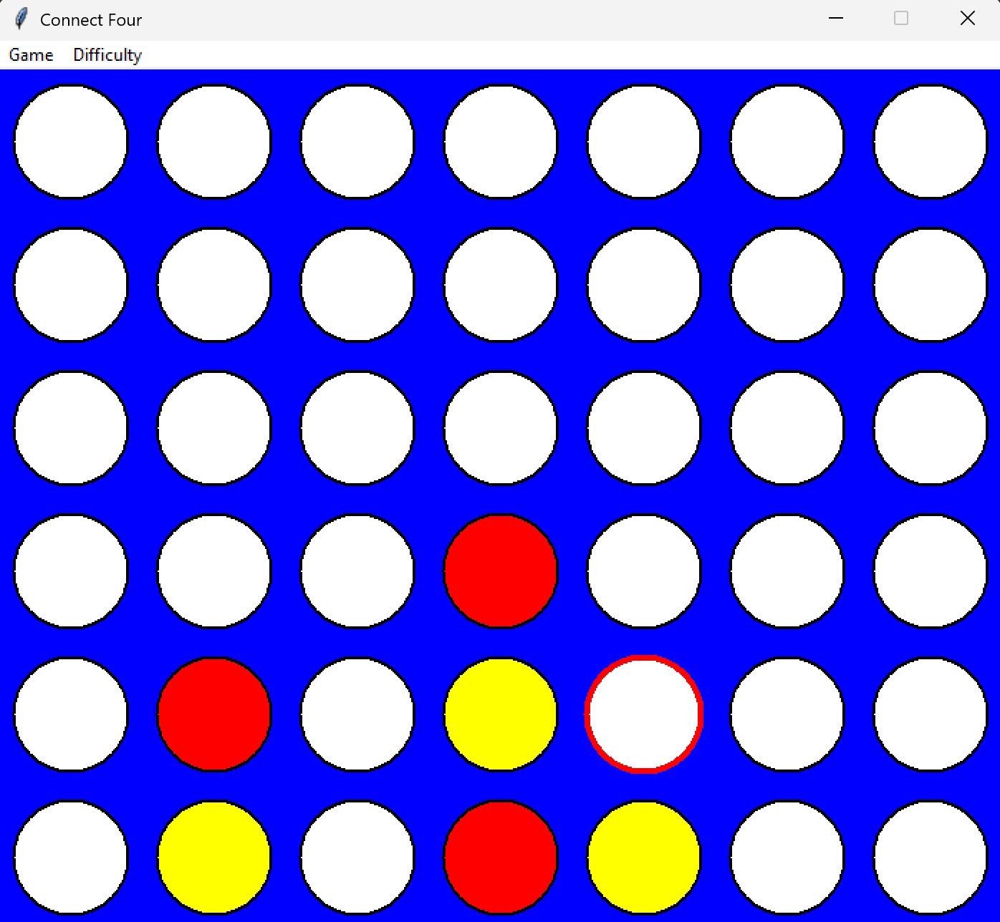

# Connect 4 with Minimax AI

A classic Connect Four game implemented in Python using `tkinter`. This project features a polished graphical user interface (GUI) and a smart AI opponent powered by the Minimax algorithm with Alpha-Beta pruning.

## 🎮 Features

* **Smart AI:** Challenge a computer opponent with three difficulty levels:
    * **Easy:** Makes random moves.
    * **Medium:** Blocks your winning moves and seizes immediate wins.
    * **Hard:** Uses Minimax with Alpha-Beta pruning to look 7 moves ahead.
* **Interactive GUI:** * Classic Blue board with Red (Player) and Yellow (Computer) tokens.
    * **Ghost Piece:** Hover over columns to see exactly where your piece will land.
    * **Move Highlight:** The computer's last move is highlighted with a green contour for better visibility.
    * **Menu Bar:** Change difficulty mid-game or start a new game instantly.
* **Clean Architecture:** Code is organized into Domain, Services, and UI layers for maintainability.
* **Robust Testing:** ~100% test coverage on core logic.

## 📸 Screenshots



## 🛠️ Installation

1.  **Clone the repository:**
    ```bash
    git clone https://github.com/ros-antonio/Connect4.git
    cd Connect4
    ```

2.  **Install Dependencies:**
    The game relies mostly on Python's standard library (`tkinter`, `math`, `random`). The only external dependency is for testing (`coverage`).
    ```bash
    pip install -r requirements.txt
    ```

## 🚀 How to Run

To start the game, simply run the `start.py` file from the root directory:

```bash
python start.py